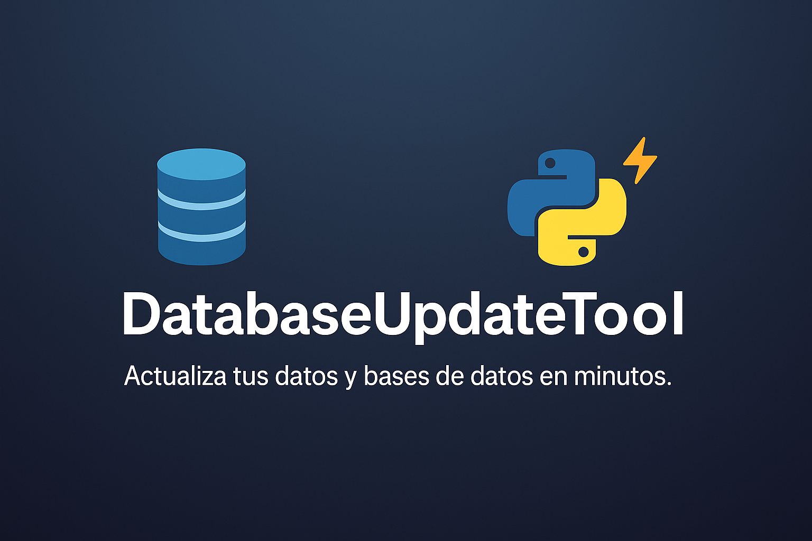
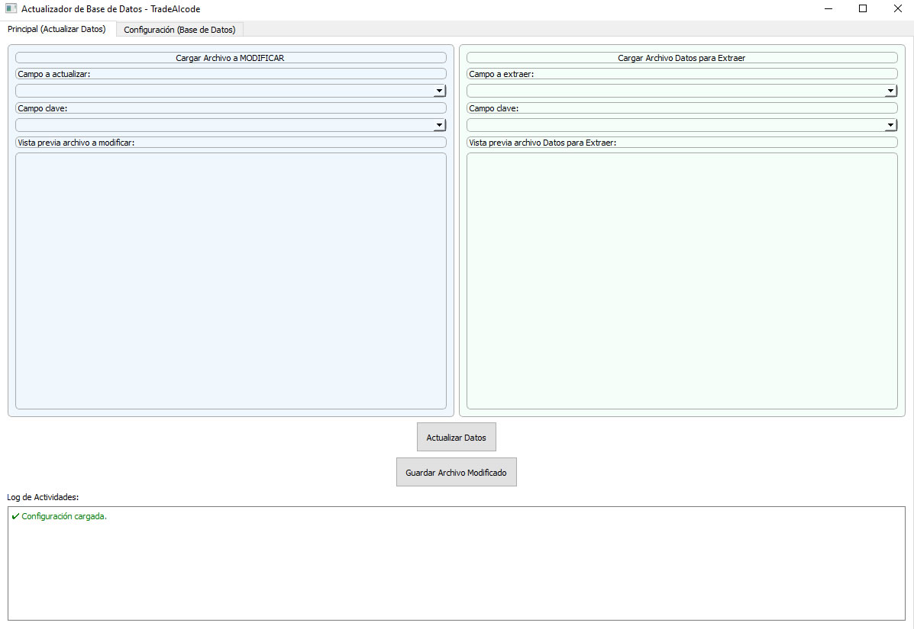

# 🛠️ DatabaseUpdateTool - TradeAIcode

[](https://www.python.org/)
[](https://pypi.org/project/PyQt5/)
[](LICENSE)

---

<p align="center">
  
</p>

---

# 📚 Tabla de Contenidos
- [📚 Descripción](#-descripción)
- [📸 Vista previa](#-vista-previa-de-la-aplicación)
- [✨ Características](#-características-principales)
- [⚙️ Instalación y requisitos](#-instalación-y-requisitos)
- [🚀 Uso detallado](#-uso-detallado)
- [💪 Tecnologías utilizadas](#-tecnologías-utilizadas)
- [📄 Licencia](#-licencia)

---

## 📚 Descripción

**DatabaseUpdateTool** es una potente herramienta en Python y PyQt5 para actualizar datos de manera rápida y segura:

- Carga un archivo antiguo para modificar.
- Carga un archivo nuevo con los datos actualizados.
- Actualiza campos automáticamente comparando por clave primaria.
- Exporta tablas completas de bases de datos a CSV o Excel.
- Soporta conexiones a **MySQL** y **SQL Server**.

Ideal para automatizar tareas de mantenimiento y actualización de registros.

---

## 📸 Vista previa de la aplicación

<p align="center">
  
</p>

---

## ✨ Características principales

- Interfaz gráfica moderna con **PyQt5**.
- Ordena columnas con un simple clic.
- Logs de actividad informativos en cada pestaña.
- Actualización de datos basada en cambios reales (sin sobreescribir vacíos).
- Exportación rápida a **CSV** y **Excel**.
- Configuración persistente usando `config.json`.
- Soporte para **MySQL** y **SQL Server**.
- Visualización del número de registros cargados.

---

## ⚙️ Instalación y requisitos

### Requisitos

- Python 3.8 o superior
- PyQt5
- pandas
- openpyxl
- pyodbc
- pymysql

Instalación rápida:

```bash
pip install -r requirements.txt
```

**Notas:**
- SQL Server requiere tener un driver ODBC instalado.
- MySQL usa `pymysql` para la conexión.

---

## 🚀 Uso detallado

### Configuración inicial

1. Abre la aplicación.
2. Ve a la pestaña **"Configuración (Base de Datos)"**.
3. Introduce:
   - Servidor
   - Puerto
   - Usuario
   - Contraseña
   - Base de datos
   - Tabla
   - Tipo de base de datos (MySQL o SQL Server)
4. Haz clic en **"Guardar Configuración"**.

### Operaciones en la base de datos

- Pulsa **"Leer y Mostrar Tabla"** para visualizar la tabla.
- Luego puedes exportar los datos a un archivo CSV o Excel.

### Actualizar datos desde archivos

1. Dirígete a la pestaña **"Principal (Actualizar Datos)"**.
2. Carga el **archivo a modificar**.
3. Carga el **archivo con datos nuevos**.
4. Selecciona:
   - Campo a actualizar
   - Campo clave (para buscar coincidencias)
5. Pulsa **"Actualizar Datos"**.
6. Verifica los cambios en la vista previa.
7. Guarda el archivo actualizado si lo deseas.

---

## 💪 Tecnologías utilizadas

- [Python](https://www.python.org/)
- [PyQt5](https://pypi.org/project/PyQt5/)
- [pandas](https://pandas.pydata.org/)
- [openpyxl](https://openpyxl.readthedocs.io/en/stable/)
- [pyodbc](https://github.com/mkleehammer/pyodbc)
- [pymysql](https://pymysql.readthedocs.io/en/latest/)

---

## 📄 Licencia

Este proyecto está licenciado bajo la licencia **MIT**. Consulta el archivo [LICENSE](LICENSE) para más detalles.

---

> Desarrollado con ❤️ por [TradeAIcode](https://github.com/TradeAIcode)

